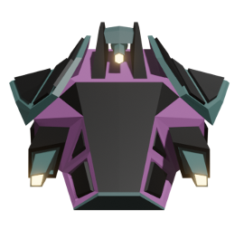
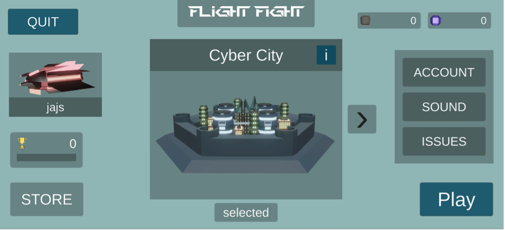
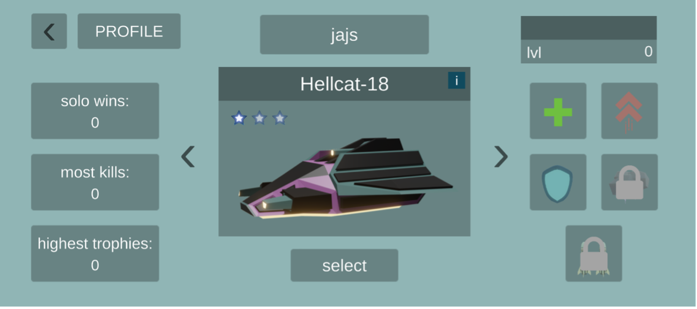
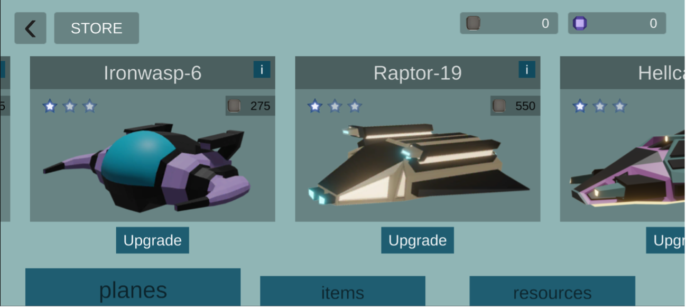
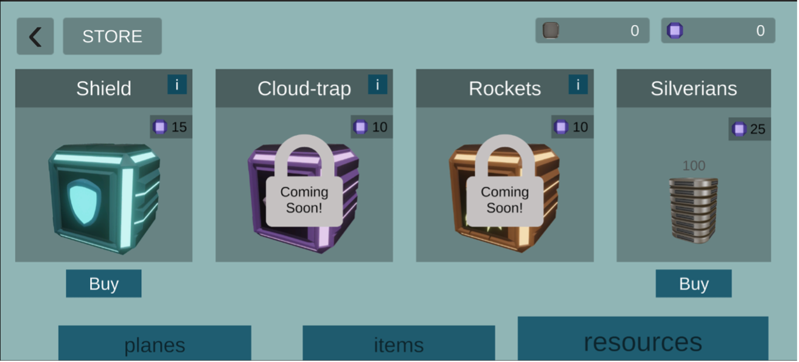
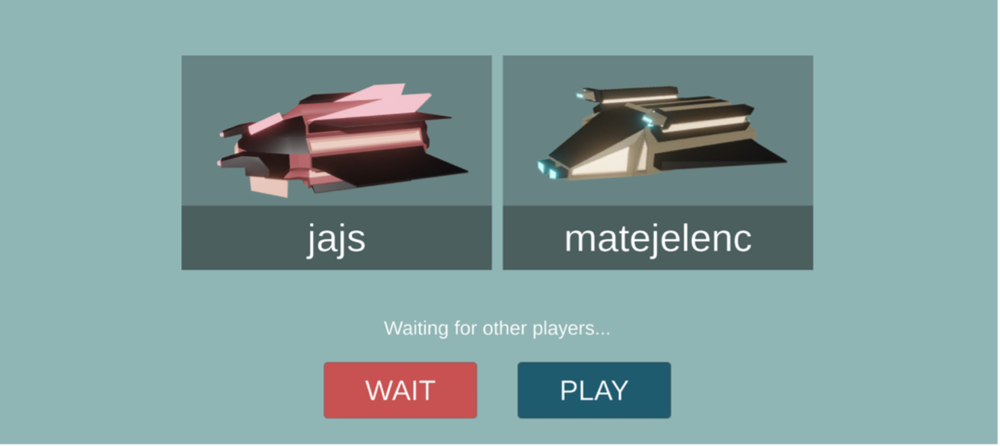
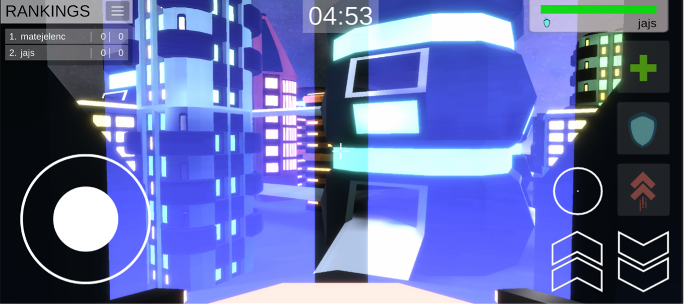
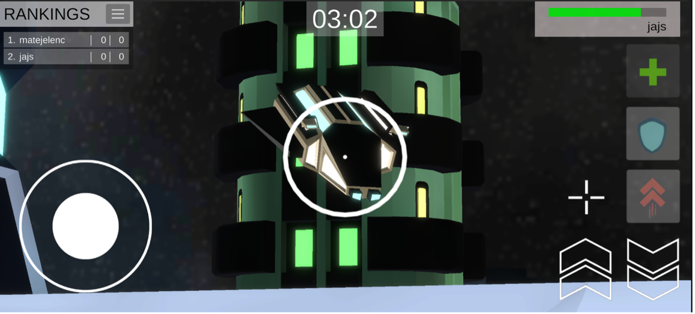
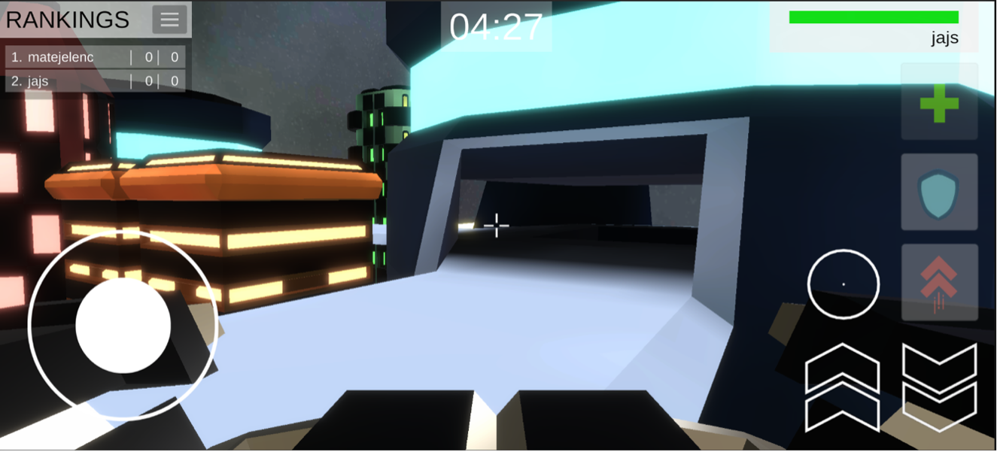
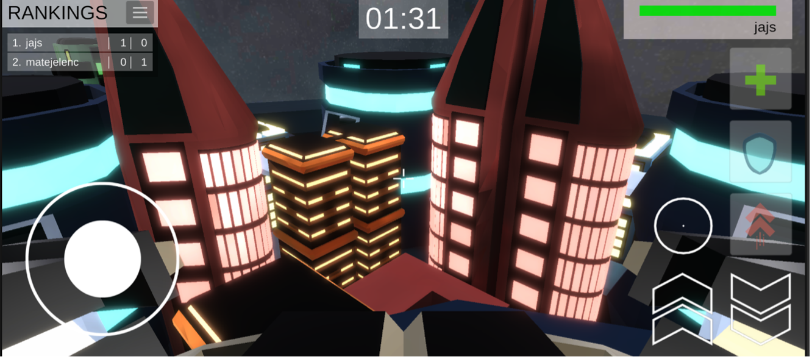

# IMPORTANT
The entire repository is not available on github due to size limit (>4GB as .zip) and can be downloaded from this [link](https://drive.google.com/file/d/1kjDxvdBHezDxuvlu5ozeFxJbeed7SjPd/view?usp=drive_link). The project has not been maintained since 2021 and most likely contains deprecated packages and a number of bugs. The entire project requires refactoring and restructuring, which will hopefully happen somewhere in the near future, as I believe that with the proper execution and better coding practices the project has potential.

# Game Play
FlightFight is a 3D fps multiplayer video game developed in Unity3D. The game consists of 2-6 players, which, each with their own aircraft fly around a cyber-like city and attempt to destroy their opponents by shooting at them, while trying to stay alive themselves. The gameplay is KDA (kills, deaths, assists) style, where the game lasts for 5 minutes and each a player dies, he is respawned back to his base and the goal of each player is to achieve the best KDA ratio. By winning games, players earn trophies and game money, with which they can buy new aircrafts, upgrade the ones they already own, or buy tools such as a health-kit, a shield or a boost, which can give them an edge during gameplay. 

# Demo
## Logo

## Homepage

## Player Profile

## Game Store

## Waiting Room

## Game Room

